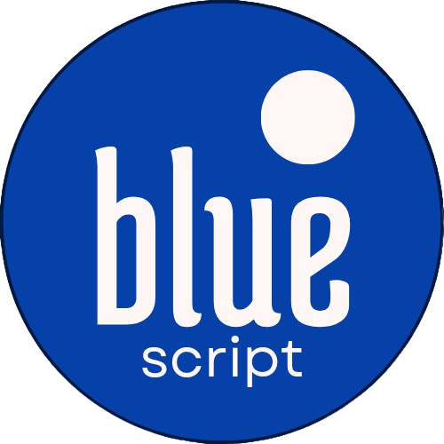

<div align="center">



# The BlueScript programming language
A general-purpose programming language that generates Lua code with a simple,
convenient and powerful syntax.

[Examples](examples/)


</div>

BlueScript claims to give the developer a comfortable, simple and effective programming 
language, with a modern and simple syntax.

BlueScript exists to improve script development with Lua.

## The most basic example: "Hello World!"

```rs
fn main() {
    println("Hello World!");
}
```
